<p align="center">
  
</p>

# tf9

`tf9` runs Terraform commands across ordered repository targets. The CLI and
local web UI share one YAML configuration file and the same binary.

## Demo

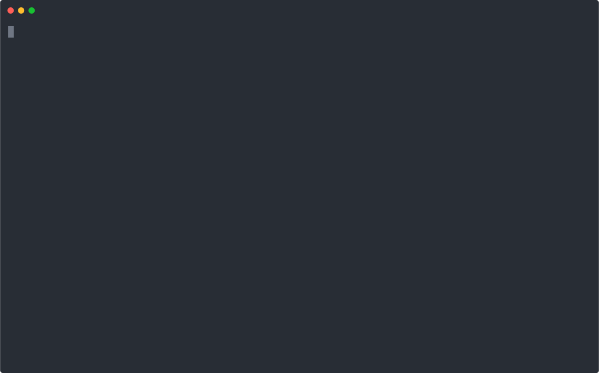

## Features

| Feature | Description |
|---|---|
| **Multi-target promotion** | Targets execute in YAML order (dev → staging → prod). `apply` stops on first failure. |
| **Registered repos** | Register any Terraform repository and its targets once; run across all of them with `--repo`. |
| **CWD mode** | Run `tf9 plan` or `tf9 apply` from any directory that contains `.tf` files — no config needed. Reports and history are recorded the same way. |
| **Native approval gate** | `apply` and `destroy` let terraform show its own plan and `Enter a value:` prompt. `--force` adds `-auto-approve` to skip it (CI/CD). |
| **Parallel execution** | `--parallel` runs up to four targets concurrently for `plan` and read-only commands, streaming prefixed output per target. |
| **Live web UI** | `tf9 serve` opens a local React UI with real-time SSE streaming, a run history panel, and per-environment terminal cards. |
| **Web approval gate** | In the web UI, an amber bar intercepts terraform's `Enter a value:` prompt — click Approve or Deny without leaving the browser. |
| **HTML reports** | Every run saves a self-contained HTML report under `~/.config/tf9/reports/`. Live reports update as each target finishes. |
| **Run history** | The last 200 CLI and web runs are persisted to `~/.config/tf9/runs.json` and visible in the Runs page. |
| **AWS SSO** | Each unique profile/account pair is validated against STS once per run; expired sessions trigger `aws sso login` automatically. |
| **Config management** | `tf9 config repo/target` commands and the in-app YAML editor share the same config file, with timestamped backups and one-click restore. |
| **Repository Workspace** | Browse and run git operations over a repo, with an AI chat assistant that can drive Terraform runs and apply changes (auto-apply by default, configurable AI model list). |
| **MCP server** | `tf9 mcp` exposes tf9 to external AI hosts (Claude Code/Desktop, IDEs) over the Model Context Protocol. Access is gated by `mcp.access_level` (default read-only); apply/destroy always route through the human approval gate and refuse `prod*` targets. Requires a running `tf9 serve`. |
| **AI run insights** | On-demand advisory for any run — blast radius, impacted service groups, and a heuristic (clearly-labeled) customer-facing read. Surfaced in the web UI, `tf9 insights`, and the `tf9_analyze_run` MCP tool; only the value-free graph is sent to the model. |
| **Cost analysis** | Infracost-backed cost scans and reports surfaced in the Cost Analysis page. |
| **Graph view** | Successful plan/apply/destroy runs render an interactive clustered graph of repos, targets, modules, and resources. |

## Screenshots

### Dashboard
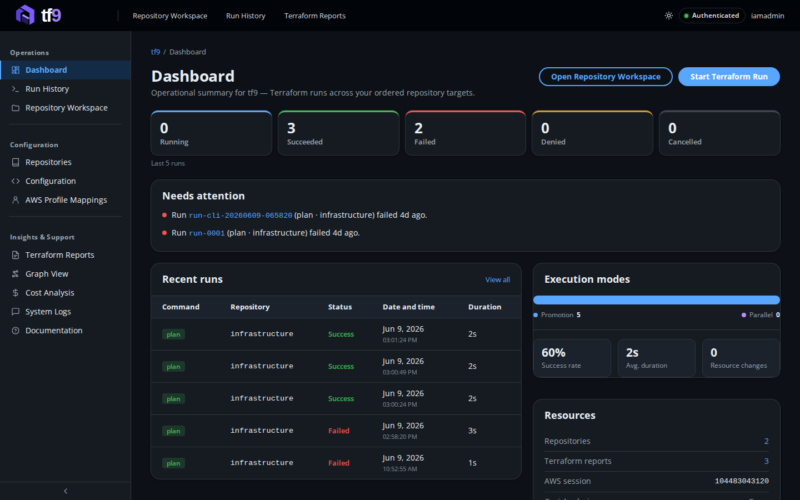

### Run History
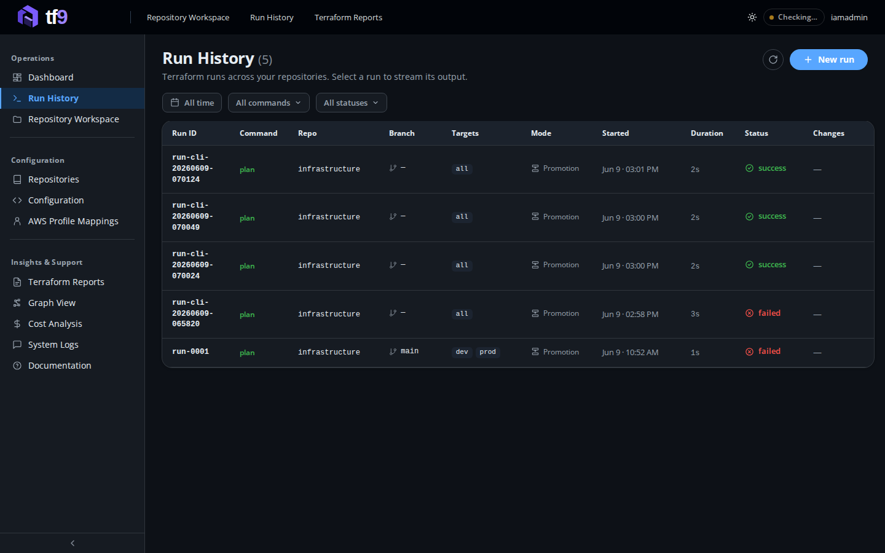

### Run detail — live split panel
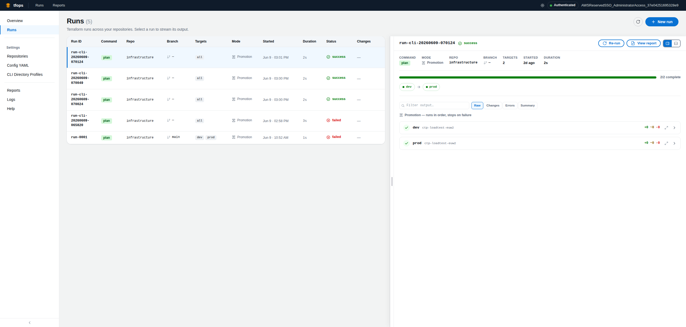

### New Run modal — command, repo, branch, targets
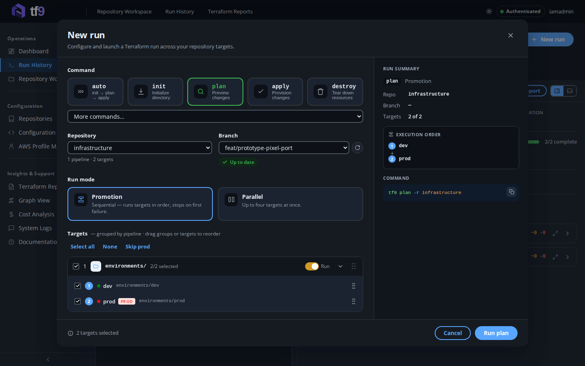

### Repositories
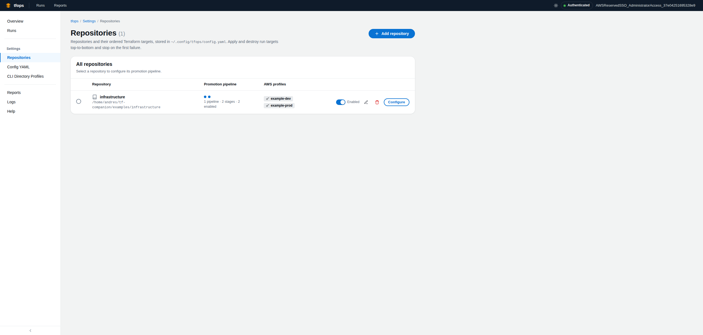

### Repository Workspace
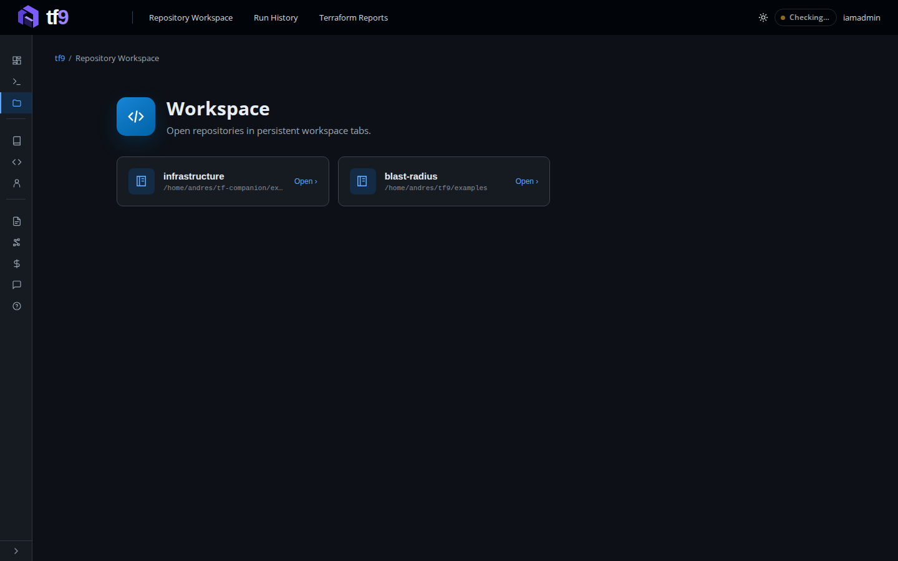

### Config YAML editor
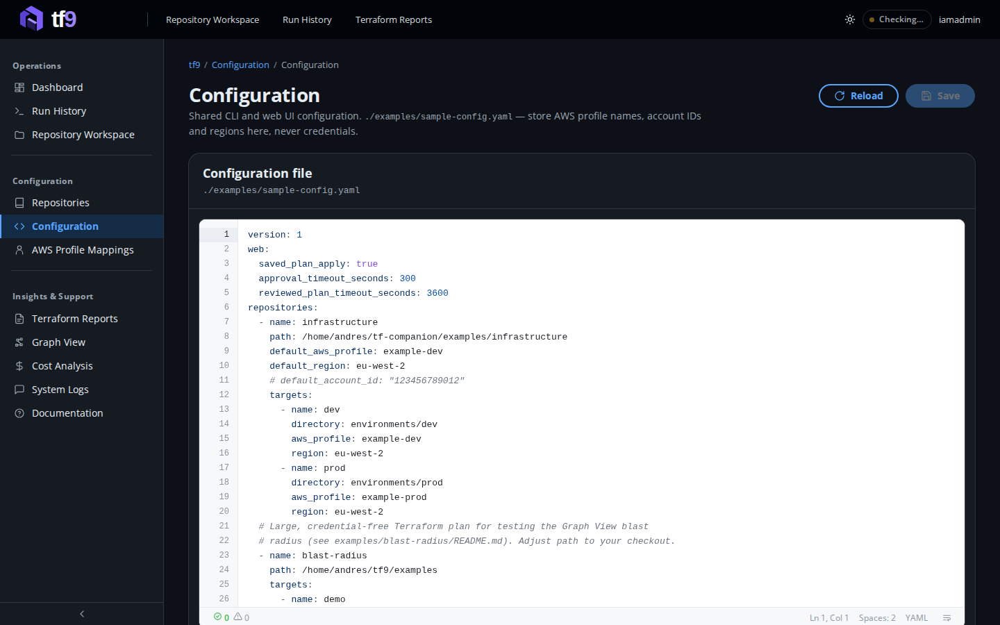

### AWS Profile Mappings
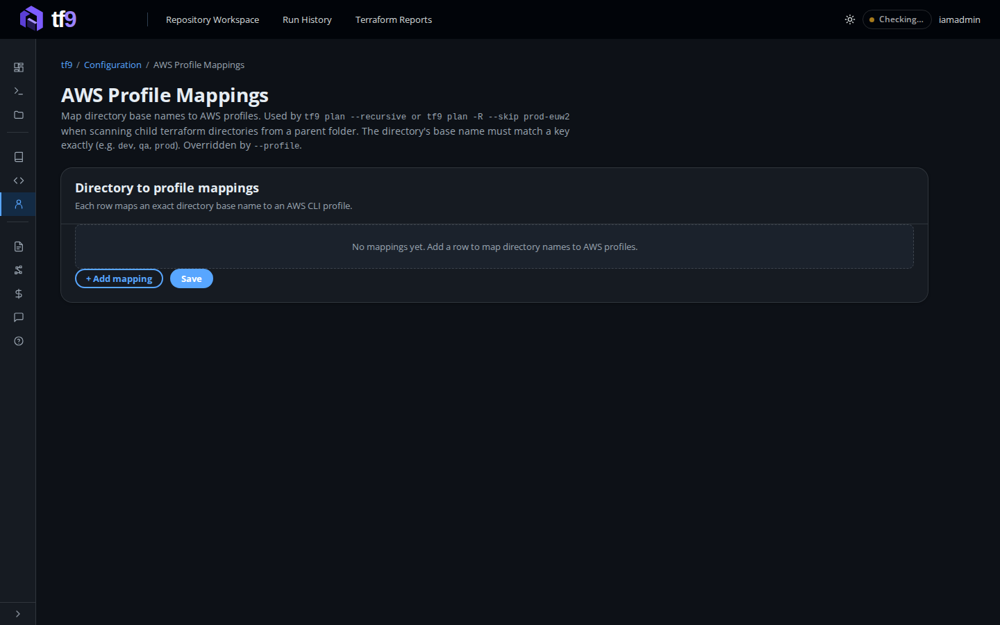

### Terraform Reports
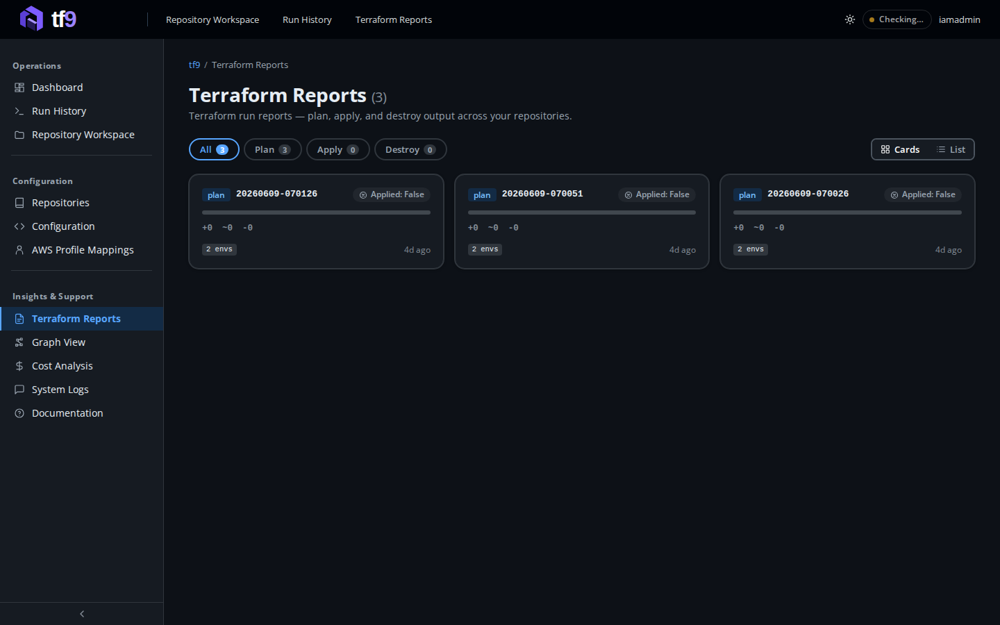

### Report viewer
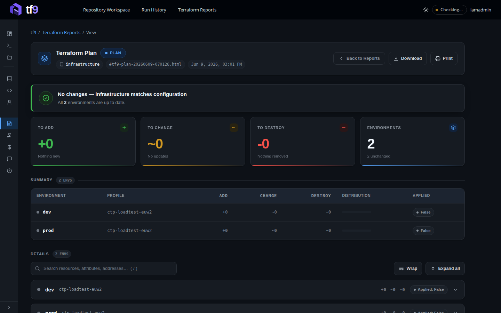

### Graph View
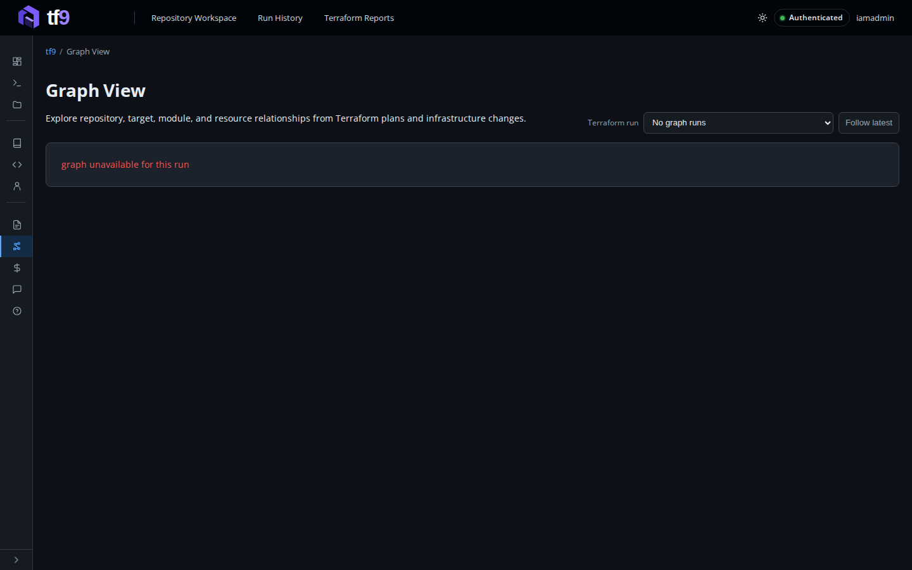

### Cost Analysis
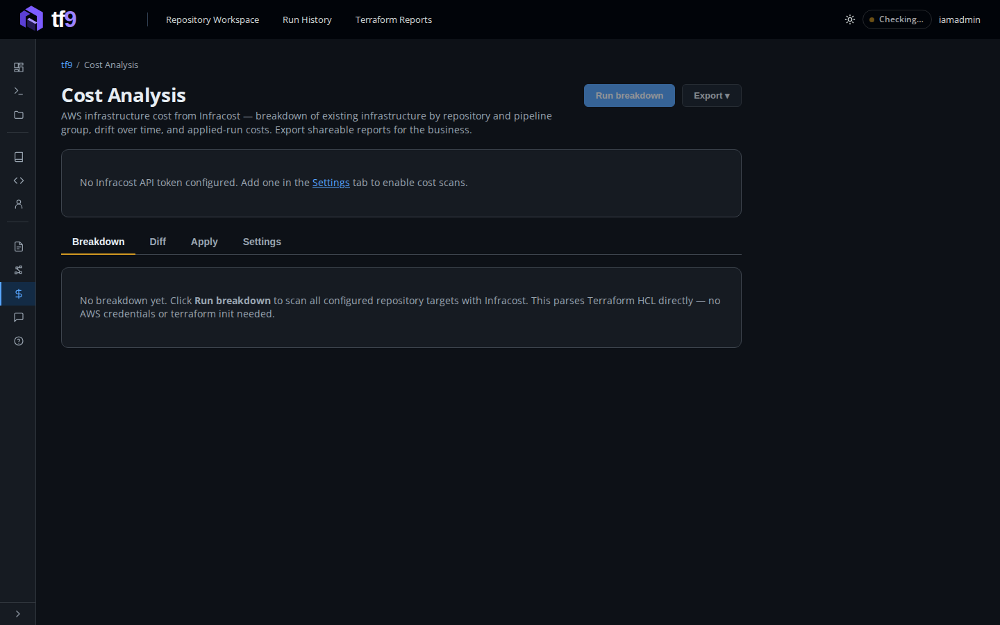

### System Logs
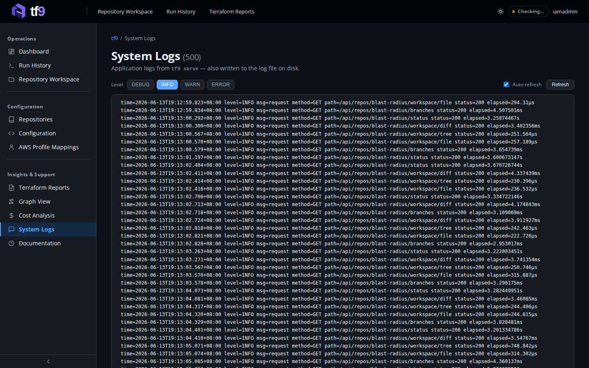

### Documentation
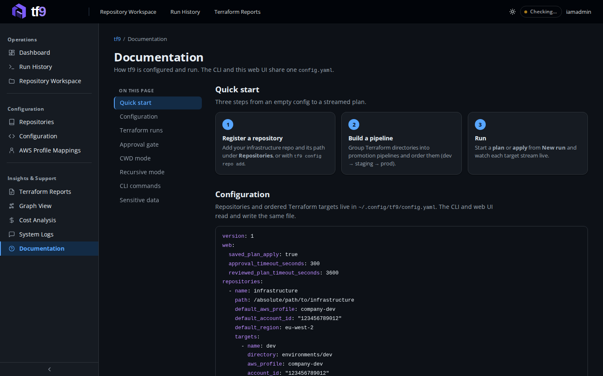

### Collapsible sidebar
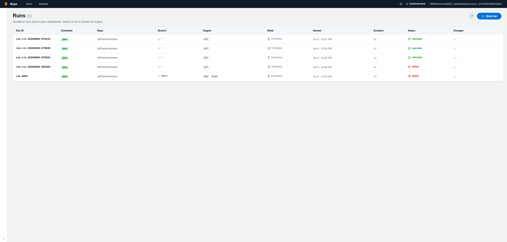

## Install

### Linux and macOS with curl

The installer detects your OS and CPU architecture, downloads the latest GitHub
release, verifies its SHA-256 checksum, and installs `tf9` to
`~/.local/bin/tf9`:

```bash
curl -fsSL https://raw.githubusercontent.com/asoltes/tf9/main/scripts/install.sh | sh
```

Install to another directory or pin a release:

```bash
curl -fsSL https://raw.githubusercontent.com/asoltes/tf9/main/scripts/install.sh |
  INSTALL_DIR=/usr/local/bin VERSION=v1.2.3 sh
```

Ensure the installation directory is on your `PATH`, then verify it:

```bash
tf9 version
```

### Download a release archive

Download the archive for your platform from
[GitHub Releases](https://github.com/asoltes/tf9/releases), verify it against
`checksums.txt`, and extract the binary:

```bash
tar -xzf tf9_1.2.3_linux_amd64.tar.gz
install -m 0755 tf9 ~/.local/bin/tf9
```

Windows releases contain `tf9.exe` in a `.zip` archive. Extract it and move it
to a directory on your `PATH`.

### Build from source

Building from source requires Go and Node.js:

```bash
git clone https://github.com/asoltes/tf9.git
cd tf9
make install
tf9 version
```

By default `make install` writes to `~/.local/bin/tf9`. Override it with
`make install BINDIR=/path/on/your/PATH`.

## Runtime Prerequisites

- Terraform
- AWS CLI v2
- Git

## Build

```bash
git clone https://github.com/asoltes/tf9.git
cd tf9
make build
```

The React frontend is embedded into the generated `tf9` binary.

To install it on your user PATH:

```bash
make install
tf9 --help
```

Source builds require Go 1.24.1 or newer and Node.js 18 or newer with npm.

## Quick Start

```bash
# Start the web UI (auto-opens browser at http://127.0.0.1:8080)
tf9 serve

# Or try the demo (no AWS/Terraform required)
make demo
```

## Configuration

The default configuration path is `~/.config/tf9/config.yaml`.

```yaml
version: 1

web:
  # Require web applies to use the exact plan saved by a reviewed Plan run.
  saved_plan_apply: true
  # Automatically deny an unattended Terraform approval prompt after 5 minutes.
  approval_timeout_seconds: 300
  # Keep the Apply reviewed plan action available for 1 hour.
  reviewed_plan_timeout_seconds: 3600
  # Optional ticket link. Use {ticket}, or omit it to append /<ticket>.
  ticketing_url: null

repositories:
  - name: infrastructure
    path: /absolute/path/to/infrastructure
    targets:
      - name: dev
        directory: environments/dev
        aws_profile: company-dev
        account_id: "123456789012"
        region: eu-west-2
      - name: staging
        directory: environments/staging
        aws_profile: company-staging
      - name: prod
        directory: environments/prod
        aws_profile: company-prod
        disabled: false
```

Targets execute in file order. `account_id`, `region`, and `disabled` are
optional. When `account_id` is present, tf9 verifies the AWS account returned
by STS before running Terraform.

Select another file with `--config` or `TF9_CONFIG`:

```bash
tf9 --config ./team-config.yaml config repo list
TF9_CONFIG=./team-config.yaml tf9 serve
```

Legacy `envs`, `repos`, and `repo-configs/*.json` files are migrated
automatically and moved to a timestamped backup directory.

## Manage Configuration

```bash
# Repositories
tf9 config repo list
tf9 config repo add infrastructure /absolute/path/to/infrastructure
tf9 config repo remove infrastructure

# Targets
tf9 config target list --repo infrastructure
tf9 config target add --repo infrastructure dev environments/dev \
  --profile company-dev --account-id 123456789012 --region eu-west-2
tf9 config target move --repo infrastructure prod --after staging
tf9 config target remove --repo infrastructure dev
```

The web UI edits the same repository targets. Settings also includes a raw
Config YAML editor for direct changes to this file. The editor validates the
schema before saving and preserves comments and ordering. Each save writes a
timestamped backup, and previous versions can be restored from the UI.

An example repo and matching config live under `examples/`:

```bash
tf9 --config ./examples/sample-config.yaml config repo list
tf9 --config ./examples/sample-config.yaml plan --repo infrastructure
```

## Run Terraform

```bash
# Plan all targets in a repo
tf9 plan --repo infrastructure

# Filter to a specific target
tf9 plan dev --repo infrastructure

# Apply and destroy — always prompt for confirmation before running
tf9 apply prod --repo infrastructure
tf9 destroy dev --repo infrastructure

# Skip confirmation (useful in CI/CD)
tf9 apply --repo infrastructure --force

# Run up to four targets concurrently (plan/state only — not apply/destroy)
tf9 plan --repo infrastructure --parallel

# Pass Terraform-specific flags after --
tf9 plan --repo infrastructure -- -refresh=false

# Resource targeting
tf9 plan --repo infrastructure --target aws_s3_bucket.example
tf9 apply --repo infrastructure --target module.network

# Mark or unmark a resource for replacement
tf9 taint --repo infrastructure --filter dev aws_instance.web
tf9 untaint --repo infrastructure --filter dev aws_instance.web

# Variable files
tf9 apply --repo infrastructure --var-file vars/override.tfvars

# Force-unlock a stuck state
tf9 apply --repo infrastructure --lock-ids dev:abc123,staging:def456

# Other Terraform commands (state, output, etc.)
tf9 state list --repo infrastructure
tf9 state list --repo infrastructure --filter dev
tf9 output --repo infrastructure

# Unmanaged run — discovers .tf directories below the current directory
tf9 plan
tf9 plan --profile my-aws-profile
```

Without `--repo`, tf9 first checks whether the current directory itself
contains `.tf` files and runs there directly. If it doesn't, it falls back to
scanning immediate subdirectories for `.tf` files. Both modes use `--profile`
or `AWS_PROFILE` for authentication, and both record reports and run history
exactly like a managed repo run.

Plan, apply, and destroy accept a positional target filter. Other Terraform
commands use `--filter`, so arguments such as `state list`, output names, import
IDs, and lock IDs pass through unchanged.

Sequential execution is the default. `--parallel` runs up to four targets
concurrently and streams output with target prefixes. Apply and destroy always
remain sequential.

Each unique AWS profile/account combination is validated once per run.

### CLI Approval Gate

For `apply` and `destroy`, tf9 runs terraform without `-auto-approve` so
terraform itself shows the full plan and then asks:

```
Do you want to perform these actions?
  Terraform will perform the actions described above.
  Only 'yes' will be accepted to approve.

  Enter a value:
```

This is identical to running `terraform apply` directly — you see exactly what
will change before confirming. Pass `--force` to add `-auto-approve` and skip
the prompt entirely (useful in CI/CD pipelines).

## Web UI

```bash
tf9 serve
tf9 serve --port 9090
tf9 serve --report latest
tf9 serve --report 2
```

The default address is <http://127.0.0.1:8080>. The server manages a PID file
so a second `tf9 serve` kills the first before starting.

### Pages

| Page | Description |
|---|---|
| **Overview** | Hub cards — quick links to all sections |
| **Runs** | Run history with status badges and live split panel |
| **Repository Workspace** | Git operations over a repo plus an AI chat assistant that can run Terraform and apply changes |
| **Repositories** | Manage repos and pipeline stages; drag-and-drop reorder |
| **AWS Profile Mappings** | Map directories to AWS profiles |
| **Config** | Raw YAML editor with schema validation, plus timestamped backup and restore |
| **Reports** | Browse and view saved HTML plan reports |
| **Graph View** | Interactive clustered graph of repos, targets, modules, and resources for a run |
| **Cost Analysis** | Infracost-backed cost scans and reports |
| **System Logs** | View the application log and adjust the runtime log level |
| **Help** | In-app documentation |

### New Run Modal

Open via the **New run** button or the `+` icon. Fields:

- **Command** — plan, apply, destroy, state, output, import, force-unlock
- **Repo** — one of the configured repositories
- **Branch** — current branch shown; pull button to fetch latest
- **Targets** — pipeline checkboxes grouped by environment; uncheck to skip
- **Auto-approve** — skip the mid-run confirmation for apply/destroy
- **Parallel** — run plan targets concurrently
- **Env filter** — type to filter which targets run
- **Extra flags** — pass raw Terraform arguments (e.g. `-target=aws_s3_bucket.x`)
- **Promotion order** — drag stages to set sequential promotion order

A live CLI preview at the bottom of the modal shows the exact command that will
run, including all resolved flags.

### Live Terminal (Split Panel)

Clicking any run opens the split panel — dock it at the **bottom** or **side**,
or go **fullscreen**. The panel streams live output via SSE as terraform runs.
Each environment gets its own collapsible terminal card.

**Promotion runs** display a vertical stepper with collapsible sections — each
stage auto-expands while running and collapses when done. The promotion stops on
first failure.

**Parallel runs** display a multi-column grid or tab view with a merged option
to see all output in one stream.

### Approval Gate (Web UI)

When `auto-approve` is off and an apply/destroy run reaches terraform's
`Enter a value:` prompt, the split panel intercepts the output and shows an
amber approval bar:

```
⚠  Terraform is waiting for your approval — only "yes" will be accepted to apply.
[  yes  ] [ Approve ] [ Deny ]
```

- **Approve** — sends `yes` to terraform; the run continues.
- **Deny** — sends `no` to terraform; the run ends with status **denied**
  (amber, distinct from the red failed status).

### Run Statuses

| Status | Color | Meaning |
|---|---|---|
| `running` | blue | Terraform is executing |
| `success` | green | All targets completed successfully |
| `failed` | red | Terraform exited non-zero (error or rejected plan) |
| `denied` | amber | User clicked Deny on the approval gate |
| `cancelled` | grey | User cancelled the run |

### Retry Failed

On a failed run, the **Retry failed** button replays only the targets that
failed. Clicking it opens the **Retry Branch Modal**, which shows:

- The current git branch
- Pull button to fetch latest changes before retrying
- Git status summary
- Confirmation to proceed

### Repositories Page

Each repository is shown as a card or table row. Actions:

- **Rename** — edit the repo name inline
- **Delete** — remove the repo from config
- **Edit stages** — open the EditStage modal to configure pipeline groups and
  promotion gates
- **Drag-and-drop reorder** — drag stage cards to change execution order

### Repository Workspace

The Repository Workspace page combines git operations over a registered repo
with an AI chat assistant. The assistant runs the local Claude Code CLI scoped
to the repository directory and helps investigate branches and reconcile drift.

- **Modes** — *Auto-apply* (default) lets the assistant edit files directly;
  *Review* asks it to propose a plan first. Switch modes from the chat header.
- **Model** — pick from a configurable model list (managed in Global settings);
  the choice is remembered per repository along with the conversation history.
- **What it can do** — read code, search, run git investigation commands
  (`fetch`/`log`/`diff`/`show`), reconcile drift via rebase/cherry-pick/merge,
  and verify with `tf9 init` / `tf9 plan`.
- **What it can never do** — `git push`, `terraform apply`, and
  `terraform destroy` are always blocked. Promoting and applying stay with you,
  through the Promote button and the terraform approval gate.

The CLI must be installed and logged in (`claude auth login`); otherwise the
chat shows an authentication notice.

### Config backup and restore

Every save to `config.yaml` — from the YAML editor or a CLI config command —
first writes a timestamped snapshot to `~/.config/tf9/backups/`. The Config
page lists snapshots and can restore any of them; a restore validates the
snapshot and backs up the current config first, so it can be undone. The most
recent 20 snapshots are kept.

## MCP Server

`tf9 mcp` runs a [Model Context Protocol](https://modelcontextprotocol.io)
server over stdio so external AI hosts (Claude Code, Claude Desktop, IDEs) can
drive tf9. It is a thin façade over a **running `tf9 serve`** — it proxies to the
same REST API, so AI-triggered runs appear live in the web UI and `runs.json`
stays single-writer. With no server running, every tool returns
`serve_not_running`.

```bash
tf9 serve        # in one place — the MCP server proxies to it
tf9 mcp          # in another — speaks MCP on stdin/stdout
```

Access is gated by `mcp.access_level` in `config.yaml` (global, default
`readonly`):

| Level | Tools added |
|---|---|
| `readonly` | `tf9_list_repos`, `tf9_list_targets`, `tf9_list_runs`, `tf9_get_run`, `tf9_get_run_output`, `tf9_get_plan_graph`, `tf9_get_cost_report` |
| `plan` | + `tf9_run_plan` (non-mutating) |
| `unrestricted` | + `tf9_run_apply`, `tf9_run_destroy` |

```yaml
# config.yaml
mcp:
  access_level: plan
```

Even at `unrestricted`, the human stays in control: apply/destroy **trigger** a
run but never auto-approve — the run waits on tf9's approval gate for a human to
approve in the web UI (there is no MCP approve/deny tool), and `prod*` targets
are always refused. No config/repo mutation tools are exposed.

Register it in your AI host as a stdio MCP server whose command is the `tf9`
binary with `args: ["mcp"]`. For Claude Code:

```bash
claude mcp add tf9 -- tf9 mcp
```

## AI Run Insights

On-demand advisory for any run with a plan/apply graph: technical **blast radius**
(what changes, what's replaced, transitive dependents), **impacted service groups**
(by your `target.group` labels), and a **customer-facing** read that is explicitly
labeled an inference. The result is cached per run and shared across surfaces.

```bash
tf9 insights              # advisory for the latest run
tf9 insights run-0247     # a specific run
tf9 insights --refresh    # regenerate (otherwise the cached one is reused)
```

Also available as a "Generate AI Insights" tab on a run in the web UI and as the
`tf9_analyze_run` MCP tool. Only the **value-free** graph is sent to the model —
raw terraform output and attribute values are never included. Generation shells
out to the `claude` CLI; set `mcp`/model preferences via the AI model list. Runs
with no changes return instantly without calling the model.

## Global CLI Flags

All `tf9` commands accept:

| Flag | Default | Description |
|---|---|---|
| `--config` | `~/.config/tf9/config.yaml` | Configuration file path |
| `--repo`, `-r` | — | Configured repository name |
| `--filter` | — | Target name filter |
| `--profile`, `-p` | — | Override AWS profile for all targets |
| `--nonprod` | false | Skip targets whose names start with `prod` |
| `--report-dir` | `~/.config/tf9/reports` | Directory to save HTML reports |
| `--no-report` | false | Disable HTML report generation |
| `--show-report` | false | Open the generated report in the web UI after run |
| `--timeout` | 30m | Maximum Terraform run duration |
| `--force` | false | Skip apply/destroy confirmation |
| `--parallel` | false | Run up to four targets concurrently |
| `--target` | — | Terraform resource or module target for plan/apply (repeatable) |
| `--var-file` | — | Terraform variable file (repeatable) |
| `--lock-ids` | — | Per-target lock IDs for force-unlock (e.g. `dev:abc,staging:def`) |

## Sensitive Data

The YAML file stores AWS profile names and optional account metadata, never AWS
credentials. Authentication remains in the AWS CLI configuration.

Terraform reports can contain infrastructure details. They are stored outside
the repository under `~/.config/tf9/reports` by default and should be reviewed
before sharing.
